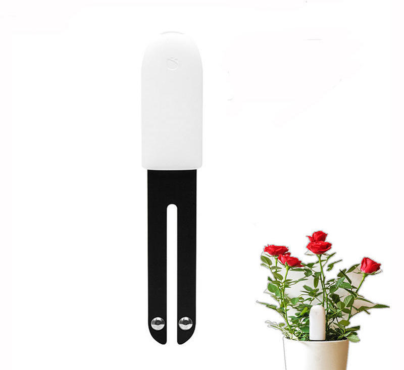

Xiaomi Mi Home (Mijia) BLE Sensors
==================================

.. seo::
    :description: Instructions for setting up Xiaomi Mi Home (Mijia) bluetooth-based sensors in ESPHome.
    :image: xiaomi_mijia_logo.jpg
    :keywords: Xiaomi, Mi Home, Mijia, BLE, Bluetooth, HHCCJCY01, GCLS002, HHCCPOT002, LYWSDCGQ, LYWSD02, CGG1, LYWSD03MMC, CGD1, JQJCY01YM, MUE4094RT, WX08ZM

The ``xiaomi_ble`` sensor platform lets you track the output of Xiaomi Bluetooth Low Energy devices using the :doc:`/components/esp32_ble_tracker`. This component will track, for example, the temperature, humidity, moisture, conductivity, illuminance, formaldehyde, mosquito tablet and battery level of the device every time the sensor sends out a BLE broadcast. Contrary to other implementations, ``xiaomi_ble`` listense passively to advertisement packets and does not pair with the device. Hence ESPHome has no impact on battery life.

Setting Up Devices
------------------
- **mac_address** (**Required**, MAC Address): The MAC address of the Xiaomi HHCCJCY01 device.
- **bindkey** (**Required**, Bind Key): The key to decrypt the BLE advertisements (32 characters = 16 bytes, case insensitive)
- **temperature** (*Optional*): The information for the temperature sensor.

  - **name** (**Required**, string): The name for the temperature sensor.
  - **id** (*Optional*, :ref:`config-id`): Set the ID of this sensor for use in lambdas.
  - All other options from :ref:`Sensor <config-sensor>`.

- **humidity** (*Optional*): The information for the humidity sensor

  - **name** (**Required**, string): The name for the humidity sensor.
  - **id** (*Optional*, :ref:`config-id`): Set the ID of this sensor for use in lambdas.
  - All other options from :ref:`Sensor <config-sensor>`.

- **moisture** (*Optional*): The information for the moisture sensor

  - **name** (**Required**, string): The name for the moisture sensor.
  - **id** (*Optional*, :ref:`config-id`): Set the ID of this sensor for use in lambdas.
  - All other options from :ref:`Sensor <config-sensor>`.

- **illuminance** (*Optional*): The information for the illuminance sensor

  - **name** (**Required**, string): The name for the illuminance sensor.
  - **id** (*Optional*, :ref:`config-id`): Set the ID of this sensor for use in lambdas.
  - All other options from :ref:`Sensor <config-sensor>`.

- **conductivity** (*Optional*): The information for the soil conductivity sensor

  - **name** (**Required**, string): The name for the soil conductivity sensor.
  - **id** (*Optional*, :ref:`config-id`): Set the ID of this sensor for use in lambdas.
  - All other options from :ref:`Sensor <config-sensor>`.

- **tablet** (*Optional*): The information for the mosquito tablet resource sensor

  - **name** (**Required**, string): The name for the mosquito tablet resource sensor.
  - **id** (*Optional*, :ref:`config-id`): Set the ID of this sensor for use in lambdas.
  - All other options from :ref:`Sensor <config-sensor>`.

- **formaldehyde** (*Optional*): The information for the formaldehyde sensor

  - **name** (**Required**, string): The name for the formaldehyde sensor.
  - **id** (*Optional*, :ref:`config-id`): Set the ID of this sensor for use in lambdas.
  - All other options from :ref:`Sensor <config-sensor>`.

- **battery_level** (*Optional*): The information for the battery level sensor

  - **name** (**Required**, string): The name for the battery sensor.
  - **id** (*Optional*, :ref:`config-id`): Set the ID of this sensor for use in lambdas.
  - All other options from :ref:`Sensor <config-sensor>`.

To find the MAC Address so that ESPHome can identify the device, you can create a simple configuration without any sensor entries:

.. code-block:: yaml

    esp32_ble_tracker:

After uploading the ESP32 will immediately try to scan for BLE devices. When it detects a new sensor, it will automatically parse the BLE message print a message like this one:

.. code::

    Found device A4:C1:38:4E:16:78 RSSI=-78
      Address Type: PUBLIC
      Name: 'LYWSD03MMC'

It can sometimes take some time for the first BLE broadcast to be received. Once the device has been found, copy the address (``A4:C1:38:4E:16:78``) into a new platform entry like shown below.

Supported devices
-----------------

MiFlora (HHCCJCY01)
^^^^^^^^^^^^^^^^^^^
Huahuacaocao Flower Care Smart Monitor, measures temperature, moisture, ambient light and nutrient levels in the soil.

    Xiaomi MiFlora (HHCCJCY01)

.. code-block:: yaml

    sensor:
      - platform: xiaomi_hhccjcy01
        mac_address: '94:2B:FF:5C:91:61'
        temperature:
          name: "Xiaomi HHCCJCY01 Temperature"
        moisture:
          name: "Xiaomi HHCCJCY01 Moisture"
        illuminance:
          name: "Xiaomi HHCCJCY01 Illuminance"
        conductivity:
          name: "Xiaomi HHCCJCY01 Soil Conductivity"
        battery_level:
          name: "Xiaomi HHCCJCY01 Battery Level"

VegTrug Grow Care Garden (GCLS002)
^^^^^^^^^^^^^^^^^^^^^^^^^^^^^^^^^^
Takasho, outside, the VegTrug is similar to the MiFlora.

.. code-block:: yaml

    sensor:
      - platform: xiaomi_gcls002
        mac_address: "94:2B:FF:5C:91:61"
        temperature:
          name: "GCLS02 Temperature"
        moisture:
          name: "GCLS02 Moisture"
        conductivity:
          name: "GCLS02 Soil Conductivity"
        illuminance:
          name: "GCLS02 Illuminance"

FlowerPot (HHCCPOT002)
^^^^^^^^^^^^^^^^^^^^^^
Huahuacaocao Smart Flower Pot, RoPot, broadcasts moisture and conductivity

.. code-block:: yaml

    sensor:
      - platform: xiaomi_hhccpot002
        mac_address: "94:2B:FF:5C:91:61"
        moisture:
          name: "HHCCPOT002 Moisture"
        conductivity:
          name: "HHCCPOT002 Soil Conductivity"

Hygro thermometer (LYWSDCGQ)
^^^^^^^^^^^^^^^^^^^^^^^^^^^^
round body, segment LCD, broadcasts temperature, humidity and battery level.

.. figure:: images/xiaomi_lywsdcgq.jpg
    :align: left
    :width: 30.0%

.. code-block:: yaml

    sensor:
      - platform: xiaomi_lywsdcgq
        mac_address: "7A:80:8E:19:36:BA"
        temperature:
          name: "LYWSDCGQ Temperature"
        humidity:
          name: "LYWSDCGQ Humidity"
        battery_level:
          name: "LYWSDCGQ Battery Level"

Hygro thermometer (LYWSD02)
^^^^^^^^^^^^^^^^^^^^^^^^^^^
rectangular body, e-ink display, broadcasts temperature and humidity values, no battery status

.. figure:: images/xiaomi_lywsd02.jpg
    :align: left
    :width: 30.0%

.. code-block:: yaml

    sensor:
      - platform: xiaomi_lywsd02
        mac_address: "3F:5B:7D:82:58:4E"
        temperature:
          name: "LYWSD02 Temperature"
        humidity:
          name: "LYWSD02 Humidity"

Hygro thermometer (CGG1)
^^^^^^^^^^^^^^^^^^^^^^^^
round body, e-ink display

.. code-block:: yaml

    sensor:
      - platform: xiaomi_cgg1
        mac_address: "7A:80:8E:19:36:BA"
        temperature:
          name: "CGG1 Temperature"
        humidity:
          name: "CGG1 Humidity"
        battery_level:
          name: "CGG1 Battery Level"

Hygro thermometer (LYWSD03MMC)
^^^^^^^^^^^^^^^^^^^^^^^^^^^^^^
small square body, segment LCD, encrypted, broadcasts temperature, humidity and battery status. Requires a bindkey in order to decrypt the received data (see below).

.. code-block:: yaml

sensor:
      - platform: xiaomi_lywsd03mmc
        mac_address: "A4:C1:38:B1:CD:7F"
        bindkey: "eef418daf699a0c188f3bfd17e4565d9"
        temperature:
          name: "LYWSD03MMC Temperature"
        humidity:
          name: "LYWSD03MMC Humidity"
        battery_level:
          name: "LYWSD03MMC Battery Level"

Cleargrass (Qingping) alarm clock (CGD1)
^^^^^^^^^^^^^^^^^^^^^^^^^^^^^^^^^^^^^^^^
segment LCD, encrypted, broadcasts temperature, humidity and battery status. Requires a bindkey in order to decrypt the received data (see below).

.. code-block:: yaml

    sensor:
      - platform: xiaomi_cgd1
        mac_address: "A4:C1:38:8C:34:B7"
        bindkey: "fe39106baeedb7c801e3d63c4396f97e"
        temperature:
          name: "CGD1 Temperature"
        humidity:
          name: "CGD1 Humidity"
        battery_level:
          name: "CGD1 Battery Level"

Xiaomi Honeywell formaldehyde sensor (JQJCY01YM)
^^^^^^^^^^^^^^^^^^^^^^^^^^^^^^^^^^^^^^^^^^^^^^^^
OLED display, broadcasts temperature, humidity, formaldehyde concentration (mg/m³) and battery status. 

.. code-block:: yaml

    sensor:
      - platform: xiaomi_jqjcy01ym
        mac_address: "7A:80:8E:19:36:BA"
        temperature:
          name: "JQJCY01YM Temperature"
        humidity:
          name: "JQJCY01YM Humidity"
        formaldehyde:
          name: "JQJCY01YM Formaldehyde"
        battery_level:
          name: "JQJCY01YM Battery Level"

Mosquito Repellent Smart Version (WX08ZM)
^^^^^^^^^^^^^^^^^^^^^^^^^^^^^^^^^^^^^^^^^
Broadcasts the tablet resource level, on/off state and battery level.

.. figure:: images/xiaomi_wx08zm.jpg
    :align: left
    :width: 30.0%

.. code-block:: yaml

    sensor:
      - platform: xiaomi_wx08zm
        mac_address: "74:a3:4a:b5:07:34"
        tablet:
          name: "WX08ZM Mosquito Tablet"
        state:
          name: "WX08ZM On/Off State"
        battery_level:
          name: "WX08ZM Battery Level"

Xiaomi Philips BLE nightlight (MUE4094RT)
^^^^^^^^^^^^^^^^^^^^^^^^^^^^^^^^^^^^^^^^^
Broadcasts if the light has been activated, default timeout is 5s.

.. code-block:: yaml

    binary_sensor:
      - platform: xiaomi_mue4094rt
        name: "MUE4094RT Nightlight"
        mac_address: "7A:80:8E:19:36:BA"
        timeout: "5s"

Obtaining the bindkey
---------------------

To set up an encrypted device such as the LYWSD03MMC or CGD1, you first need to obain the bind key. The ``xiaomi_ble`` sensor component is not able to automatically generate a bind key, so you need to use the original Mi Home app to add the sensor once. While adding the device, a new key is generated and uploaded into the Xiaomi cloud and to the device itself. Currently a chinese server needs to be selected as the rest of the world doesn't support most of these devices yet. Once generated, the key will not change again until the device is removed and re-added in the Xiaomi app.

In order to obtain the bind key, a SSL packet sniffer needs to be setup on either an Android phone or the
iPhone. A good choice for Android is the `Remote PCAP <https://play.google.com/store/apps/details?id=com.egorovandreyrm.pcapremote&hl=en>`__ app in combination with Wireshark. A tutorial on how to setup the Remote PCAP packet sniffer can be found `here <https://egorovandreyrm.com/pcap-remote-tutorial/>`__. More info including some instructions for the iPhone are `here <https://github.com/custom-components/sensor.mitemp_bt/blob/master/faq.md#my-sensors-ble-advertisements-are-encrypted-how-can-i-get-the-key>`__. Once the traffic between the Mi Home app and the Xiaomi has been recorded, the bind key will show in clear text:

.. code-block:: yaml

    packet: POST /app/device/bltbind

    "data" = "{"did":"blt.3.129q4nasgeg00","token":"20c665a7ff82a5bfb5eefc36","props":[{"type":"prop","key":"bind_key","value":"cfc7cc892f4e32f7a733086cf3443cb0"},   {"type":"prop","key":"smac","value":"A4:C1:38:8C:34:B7"}]}"

The ``bind_key`` is the 32 digits "value" item in the above output which needs to be inserted into the config file. 
    

See Also
--------

- :doc:`/components/esp32_ble_tracker`
- :doc:`/components/sensor/index`
- :apiref:`xiaomi_lywsd03mmc/xiaomi_ble.h`
- Xiaomi Home Assistant mitemp_bt custom component `<https://github.com/custom-components/sensor.mitemp_bt>`__
  by `@Magalex2x14 <https://github.com/Magalex2x14>`__
- More info on the bind key `<https://github.com/custom-components/sensor.mitemp_bt/blob/master/faq.md#my-sensors-ble-advertisements-are-encrypted-how-can-i-get-the-key>`__
- Xiaomi LYWSD03MMC passive sensor readout `<https://github.com/ahpohl/xiaomi_lywsd03mmc>`__ by `@ahpohl <https://github.com/ahpohl>`__

- :ghedit:`Edit`
